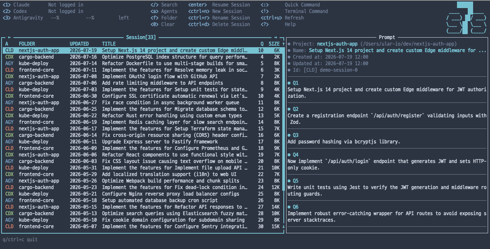
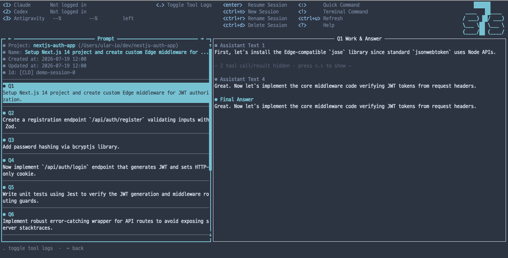
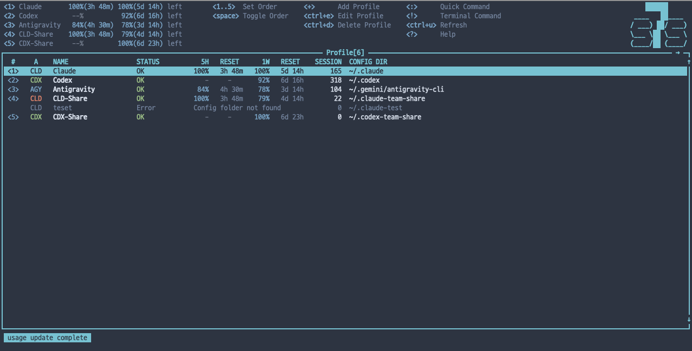
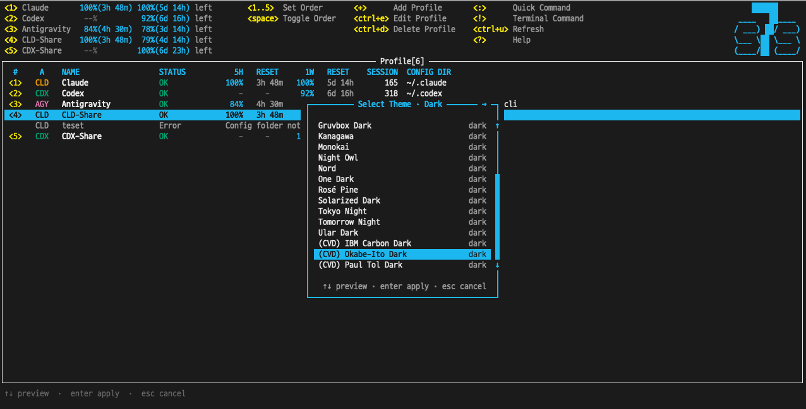
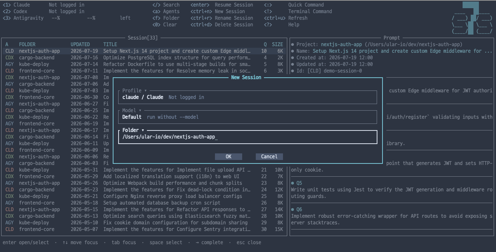
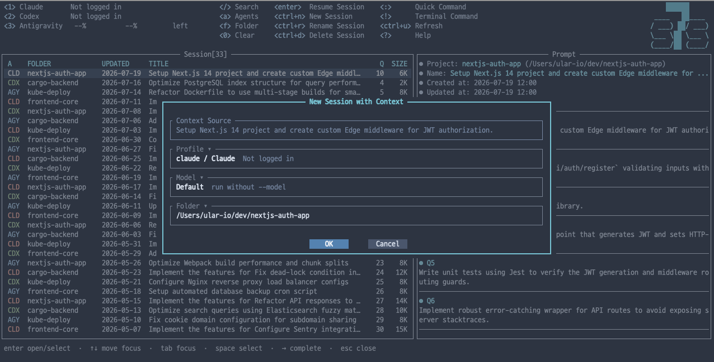
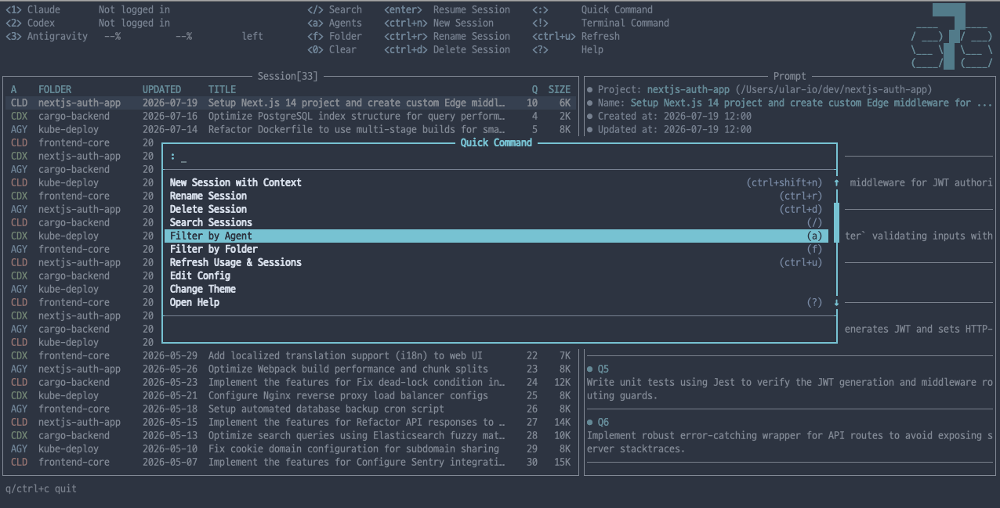

# s7s

A terminal dashboard that integrates **search and management** across Claude Code, Antigravity CLI, and Codex conversation sessions in a **single, unified TUI**. It allows you to monitor usage, manage sessions, and instantly resume work in your project folders with their respective agent CLIs.


## Screenshots

### Main Dashboard


### Session Detail View


### Profile Dashboard


### Theme Selection


### New Session Dialog


### New Session with Context


### Quick Command Palette



## Key Features

- **Rust-Powered & Blazingly Fast**: Built with Rust combined with database-backed caching for instantaneous loading. The initial scan builds the database cache, enabling subsequent lookups to query the cache directly for near-instantaneous load times.
- **Integrated TUI Search**: Search and filter past sessions scattered across Claude, Codex, and Antigravity from a single consolidated screen.
- **At-a-Glance Usage Monitor**: Track remaining quotas and usage limits for all active profiles and agents directly in the header (e.g., ` 72%(4h 30m)  52%(2d 16h) left`).
- **Comprehensive Session Management**: View transcripts, resume conversations, rename session titles, or delete redundant histories directly from the TUI.
- **Inter-Session Context Sharing**: Feed summaries or full history of past sessions as bootstrap context when starting a new session (New Session with Context).
- **Dozens of Visual Themes**: Personalize your workspace with 40 built-in themes, including specialized dark/light variants (Nord, Dracula, Tokyo Night, Ular) and accessibility-focused CVD (Color Vision Deficiency) safe palettes.

### Core Capabilities

- **Database-Backed Fast Caching**: Caches parsed session details in a local database index (`~/.cache/s7s/index.bin`). Once indexed, queries run directly against the cache database for blazingly fast session retrieval.
- **Smart Incremental Updates**: Tracks file modification times (`mtime`) on startup, scanning and parsing only newly added or modified session files to sync the database incrementally.
- **Clean Parser**: Refines raw logs to extract and render only human-readable user turns.
- **Unicode Normalization (NFC)**: Standardizes search blobs and keyword inputs to NFC to prevent search misses caused by macOS NFD issues (common in Korean Jamo and European diacritics).
- **Bidirectional Lifecycle**: Retains current search/filter states when switching between TUI and agent CLI subprocesses.
- **Multi-Profile Support**: Organizes different subscriptions (e.g., personal vs. team accounts) by mapping config directories and injecting variables like `CLAUDE_CONFIG_DIR` or `CODEX_HOME` dynamically — [Details](docs/profiles.md).


## Build / Installation

### Via Homebrew (macOS)
```bash
brew tap ular-io/s7s
brew install s7s
```

> [!NOTE]
> On macOS, since custom Homebrew tap binaries are unsigned, Gatekeeper may block execution on the first run. You may need to grant trust under **System Settings > Privacy & Security** (click "Allow Anyway"), or manually clear the quarantine attribute:
> ```bash
> xattr -rd com.apple.quarantine $(which s7s)
> ```

### Build and Install Manually
```bash
cargo build --release
# Executable file: target/release/s7s
cp target/release/s7s ~/bin/   # Copy to your desired PATH location
```

## Usage

```bash
s7s                         # Run TUI
s7s demo                    # Run TUI in demo mode using mock English sessions (generates mock sandbox under project 'example' folder)
s7s session <SESSION_ID>    # View past session context (no TUI, see below)
s7s --rebuild-cache         # Force rebuild the entire session cache
s7s --print                 # Print the session list only, without TUI (debug)
s7s --usage-probe           # Print usage probe results only, without TUI (debug)
s7s --model-probe           # Print model list probe results only, without TUI (debug; no cache update)
s7s --handoff-samples [DIR] # Generate one deterministic handoff Markdown sample per agent (debug)
s7s --help                  # Print help
s7s --version               # Print version
```

### Shortcuts (Session Screen)

| Key | Action |
| :-- | :-- |
| `:` | Screen selection menu (`s` Session / `p` Profile) |
| `!` | Terminal command in session folder (run shell command in the selected session's folder) |
| `/` | Keyword search mode (real-time body/title matching, space=AND) |
| `a` | Agents modal (`space` toggle, `enter` apply) |
| `1` ~ `5` | Active profile exclusive filter (header number order) |
| `0` | Reset all filters |
| `f` | Folder modal (typing=filter, `space` toggle, `enter` apply) |
| `ctrl+u` | Update Session (reflect session list additions/changes + recheck usage) |
| `ctrl+n` | New Session (Profile/Model/Folder dialog) |
| `ctrl+shift+n` | New Session with Context (attach selected session as past context, see below) |
| `ctrl+r` | Rename Session |
| `ctrl+d` / `del` | Confirm Delete Session |
| `tab` / `shift+tab` | Toggle focus between left table ↔ right preview panel |
| `↑`/`↓` (`k`/`j`) | Table focus=move row / Preview focus=scroll body |
| `g` / `G` (`home` / `end`) | Jump to start / end |
| `pageup` / `pagedown` | Scroll preview body |
| `enter` | Resume Session |
| `esc` | Cancel search/filter/selection state (reset keyword/filter, close modal) — **Not quit** |
| `q` / `ctrl+c` | Press again to quit |

All filters (Keyword · Agent · Folder · Profile) operate with an **AND combination**.

### Shortcuts (Profile Screen, `:` → `p`)

| Key | Action |
| :-- | :-- |
| `enter` | Start new session with selected profile (type folder directly or select existing folder with `↑`/`↓`, copy full path with `tab`) |
| `space` | Toggle profile activation (target for header display/number keys, session list keeps all) |
| `1` ~ `5` | Insert selected profile at shortcut position |
| `+` | Add profile |
| `ctrl+e` | Edit profile |
| `ctrl+d` | Delete profile (default profile cannot be deleted, actual folder remains) |
| `ctrl+u` | Refresh all profile usages (keeps showing previous value during refresh) |
| `→` / `l` | Return to session screen |

## Session Context

You can view the conversation history of a past session as a reference context, or start a new session by attaching the selected session as context — [Details](docs/session-context.md).

### `s7s session` — Context View CLI

```bash
# All active user turns + assistant excerpts (past 500 chars / last turn 2,000 chars)
s7s session 019f36e8-9157-7c63-bee8-8937a6314982

# User turns only
s7s session 019f36e8-9157-7c63-bee8-8937a6314982 --user-only

# Full (redacted) details of a single turn
s7s session 019f36e8-9157-7c63-bee8-8937a6314982 --turn 7

# For new session initialization (includes instruction envelope)
s7s session 019f36e8-9157-7c63-bee8-8937a6314982 --agent codex --profile builtin-codex --bootstrap
```

- The default output is a **neutral reference mode**: It contains only trust boundary phrases and has no stop/wait/language instructions, making it safe to run inside another ongoing agent session.
- The full session ID is interpreted as an exact match across all profiles, and if multiple matches occur, it lists the candidates and requires `--agent`/`--profile` specification. Secrets are masked before excerpting.
- See `s7s session --help` for detailed options, excerpt limits, and error rules.

### New Session with Context

Pressing `ctrl+shift+n` (or **New Session with Context** in the `:` palette) on the Session/Detail screen opens the existing New Session dialog with the focused session captured as the **source session** (indicated in the title). Profile/Model/Folder can be freely selected as usual — you can also start with a different agent/project than the source. Upon OK, a short bootstrap prompt is injected into the new agent, and the new agent reads the source using `s7s session ... --bootstrap`, leaving a ready message in the source language without performing past tasks. Subsequent actual requests (including long text/images) can be entered in the agent's own UI.

> **Terminal Compatibility**: Legacy terminals cannot distinguish between `Ctrl+Shift+N` and `Ctrl+N` (same control byte). s7s only distinguishes chords in terminals that support the kitty keyboard protocol; in other environments, **New Session with Context** in the `:` palette is the guaranteed fallback.

## Data Sources

| Agent | Path | Session ID | resume |
| :-- | :-- | :-- | :-- |
| Claude | `~/.claude/projects/<enc>/<id>.jsonl` | Filename | `claude --resume <id>` |
| Codex | `~/.codex/sessions/YYYY/MM/DD/rollout-*.jsonl` | `session_meta.id` | `codex resume <id>` |
| Antigravity | `~/.gemini/antigravity-cli/history.jsonl` + `cache/conversation_metadata.json` | `conversationId` | `agy --conversation <id>` |

> Codex uses the actual path `~/.codex/sessions/` instead of `~/.config/codex/history/` from the PRD, and Antigravity uses `~/.gemini/antigravity-cli/` instead of `~/.config/antigravity/history/`.

## Profiles (Multiple Subscriptions)

The profile list is saved by the app in `~/.config/s7s/profiles.json` (or `~/Library/Application Support/s7s/` on macOS), and seeds the default 3 (Claude/Antigravity/Codex) on first run. You can add/edit them in the profile screen via `:` → `p`.

- **path** = Agent config root (e.g., `~/.claude-team`). The session directory is automatically derived (Claude `<path>/projects`, Codex `<path>/sessions`, Antigravity is the path itself).
- `CLAUDE_CONFIG_DIR`/`CODEX_HOME` is injected only for profiles that are not the default path. Specifying the env on the default path causes a re-login screen issue — [Details](docs/profiles.md).
- For additional profiles, you must complete **one manual login + folder trust** with that config for usage checking to work.

## Configuration (Optional)

You can override the path/`resume` command template with `~/.config/s7s/config.toml`.
resume template tokens: `{id}` (session ID), `{cwd}` (working folder). When executed, it runs synchronously in the login shell in the form of `cd {cwd} && <template>`. New sessions use the `new_*` template.

You can open this file using the **Edit Config** command in the `:` palette. If the file does not exist, a template with all keys commented out (showing built-in defaults) is automatically created. Only uncommented keys override the defaults.

```toml
resume_claude = "claude --resume {id}"
resume_codex = "codex resume {id}"
resume_antigravity = "agy --conversation {id}"
new_claude = "claude"
new_codex = "codex"
new_antigravity = "agy"
editor = "vim"
```

- **editor** = Default editor command (optional). If set, it is exported as `EDITOR`/`VISUAL` to the `!` Terminal Command execution shell, applying to commands that bring up an editor like `git commit`. The **Edit Config** command also uses this editor (if unset, it falls back to `$VISUAL` → `$EDITOR` → `vi`), and the settings are immediately reloaded upon returning to s7s after saving. If the editor execution fails (e.g., typo in command), it asks whether to reopen with vim.
  GUI editors must include a flag to wait until closed (e.g., `code -w`).

> **Antigravity resume**: The Antigravity CLI executable is `agy`, and it resumes conversations with `agy --conversation <id>`. If `agy` is not in the PATH, replace `resume_antigravity` with an absolute path (e.g., `~/.local/bin/agy --conversation {id}`).

## Themes

Change the color theme using the **Change Theme** command in the `:` palette. The dialog shows either the Dark or Light list at once and switches between the lists with ←/→ (left/right arrows on the top border). Previews are applied immediately upon ↑/↓ movement, confirmed with enter (selection is saved to `~/.config/s7s/theme.json`), and reverted to the pre-open theme with esc. There are 40 built-in themes (20 Dark · 20 Light).

- **10 Basic** — Dark: **Nord** (default) · Tokyo Night · Dracula · Gruvbox Dark · Solarized Dark · Catppuccin Mocha / Light: GitHub Light · Solarized Light · Gruvbox Light · Catppuccin Latte.
- **10 Popular** — Dark: Monokai · One Dark · Night Owl · Ayu Dark · Everforest Dark · Rosé Pine · Kanagawa / Light: One Light · Ayu Light · Everforest Light.
- **3 Dark** — Official dark sister versions of built-in light themes: GitHub Dark · Flexoki Dark · Tomorrow Night.
- **9 Light** — 4 official light sister versions of built-in dark themes (Tokyo Night Day · Rosé Pine Dawn · Kanagawa Lotus · Night Owl Light) and 5 popular light palettes (Flexoki Light · Selenized Light · PaperColor Light · Tomorrow · Modus Operandi).
- **Ular Dark · Ular Light** — Ular Light is a light palette with steel blue ink/accents on a cream background (`#FDF6E3`) (all colors are fixed hex, so they look the same regardless of terminal color scheme), Ular Dark is a custom dark palette with brand colors (cyan accents, agent badge colors) on a dark gray-blue background.
- **6 Color-Vision-Deficiency (CVD) Safe** — 3 Dark/Light each (placed at the end of the list). Maps success/error to blue↔orange/vermilion/magenta instead of green↔red so that severity can be distinguished even in red-green or blue-yellow color blindness. Based on 3 verified color-blind safe palettes (Okabe-Ito · IBM Carbon · Paul Tol): Okabe-Ito Dark/Light · IBM Carbon Dark/Light · Paul Tol Dark/Light.

Custom themes are automatically included in the list if you create a `~/.config/s7s/themes/<key>.toml` file. It inherits from `base` (built-in theme key, default `nord`) and only overrides the roles specified in `[colors]`. Color values support `#RRGGBB` hex, ANSI names (`red`, `darkgray`, ...), and `default` (terminal's own color).

```toml
name = "My Theme"
dark = true
base = "nord"

[colors]
bg = "default"        # keep the terminal's own background
accent = "#88C0D0"    # focus borders / selection
```


## Documentation

- [AGENTS.md](./AGENTS.md)
- [Panel Focus Style](./docs/panel-focus-style.md)
- [Preview Omission Style](./docs/preview-omission-style.md)
- [Session Title Compatibility](./docs/session-title-compat.md)
- [Testing Guide](./docs/testing.md)
- [Usage Display](./docs/usage-display.md)
- [Profiles](./docs/profiles.md)
- [Session Context](./docs/session-context.md)
