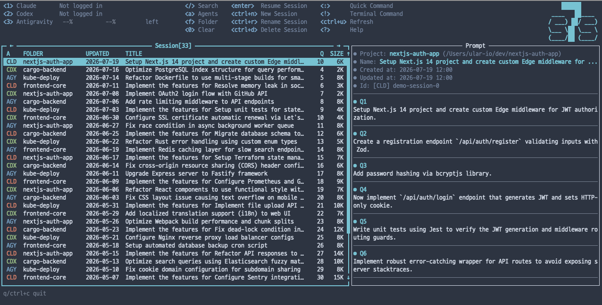
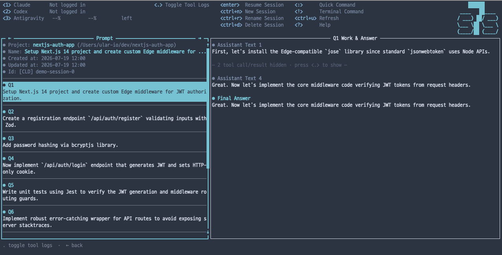
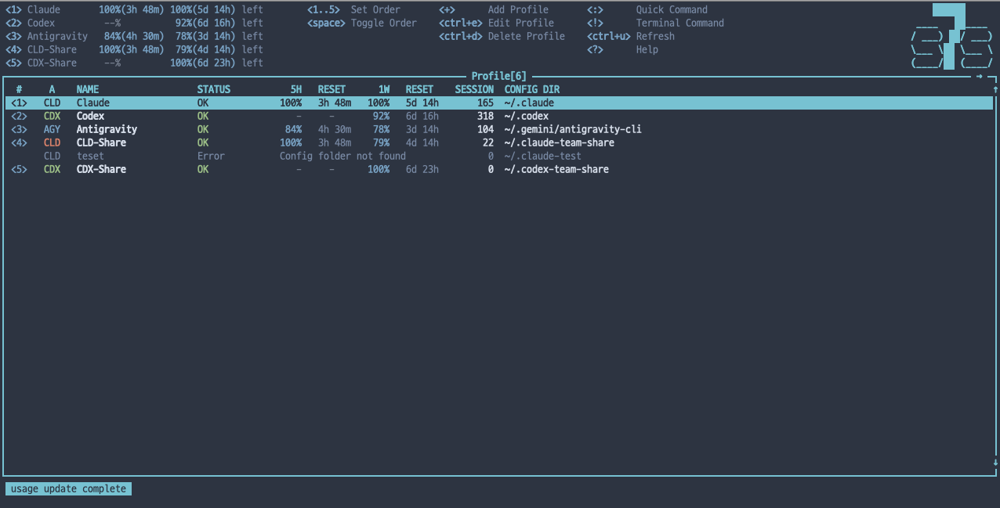
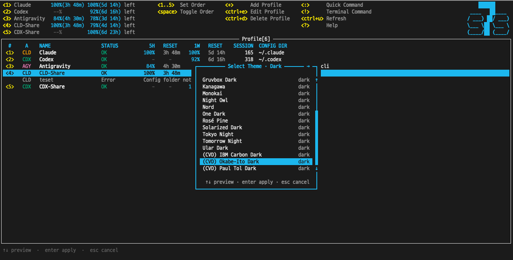
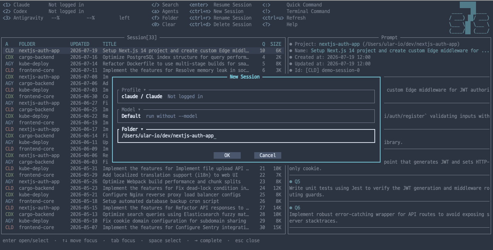
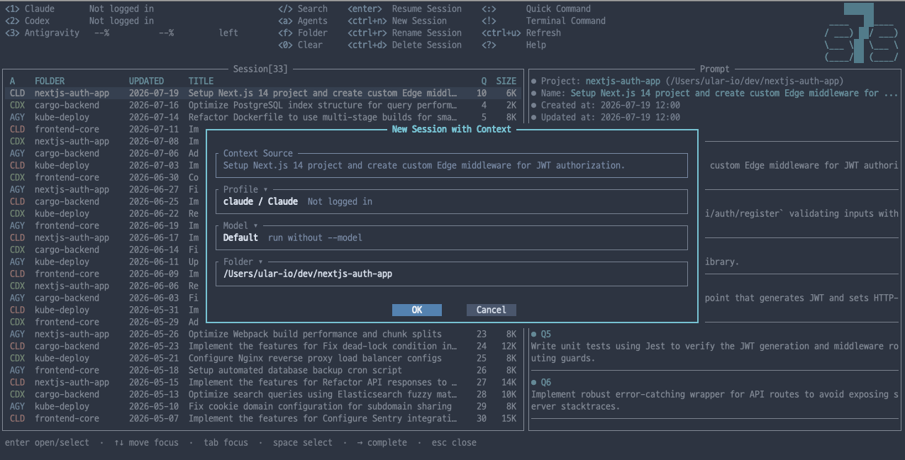
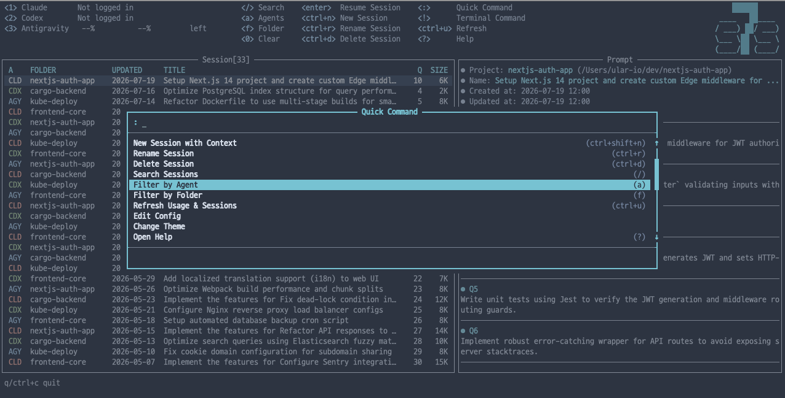

# s7s

A terminal dashboard that integrates **search and management** across Claude Code, Antigravity CLI, and Codex conversation sessions in a **single, unified TUI**. It allows you to monitor usage, manage sessions, and instantly resume work in your project folders with their respective agent CLIs.


## Screenshots

### Main Dashboard


### Session Detail View


### Profile Dashboard


### Theme Selection


### New Session Dialog


### New Session with Context


### Quick Command Palette



## Key Features

- **Rust-Powered & Blazingly Fast**: Built with Rust combined with database-backed caching for instantaneous loading. The initial scan builds the database cache, enabling subsequent lookups to query the cache directly for near-instantaneous load times.
- **Integrated TUI Search**: Search and filter past sessions scattered across Claude, Codex, and Antigravity from a single consolidated screen. Keyword search spans user prompts, titles, folder names, and each turn's last assistant answer, so you can find a session by something the agent said.
- **At-a-Glance Usage Monitor**: Track remaining quotas and usage limits for all active profiles and agents directly in the header (e.g., ` 72%(4h 30m)  52%(2d 16h) left`).
- **Comprehensive Session Management**: View transcripts, resume conversations, rename session titles, change the folder a session runs in, or delete redundant histories directly from the TUI — and do the same from the shell with `s7s session`.
- **Project-Free Scratch Sessions**: Pick `[SCRATCH]` at the top of the New Session folder list to start an agent with no project attached — for a question or a quick check. It runs in a shared folder (`~/.config/s7s/scratch`) that is emptied on every start and carries a policy file telling the agent to ask you for a target directory before writing anything, so nothing important is left in a throwaway location.
- **Inter-Session Context Sharing**: Feed summaries or full history of past sessions as bootstrap context when starting a new session (New Session with Context).
- **Work Handoff**: Park a task you are not doing now in a new session (`s7s session handoff`). The parked session records the work order and stops without acting on it, and keeps a link back to the session it came from, so `ctrl+o` walks to the origin when the work is picked up later.
- **Dozens of Visual Themes**: Personalize your workspace with 40 built-in themes, including specialized dark/light variants (Nord, Dracula, Tokyo Night, Ular) and accessibility-focused CVD (Color Vision Deficiency) safe palettes.

### Core Capabilities

- **Database-Backed Fast Caching**: Caches parsed session details in a local database index (`~/.cache/s7s/index.bin`). Once indexed, queries run directly against the cache database for blazingly fast session retrieval.
- **Smart Incremental Updates**: Tracks file modification times (`mtime`) on startup, scanning and parsing only newly added or modified session files to sync the database incrementally.
- **Clean Parser**: Refines raw logs to extract and render only human-readable user turns.
- **Unicode Normalization (NFC)**: Standardizes search blobs and keyword inputs to NFC to prevent search misses caused by macOS NFD issues (common in Korean Jamo and European diacritics).
- **Bidirectional Lifecycle**: Retains current search/filter states when switching between TUI and agent CLI subprocesses.
- **Multi-Profile Support**: Organizes different subscriptions (e.g., personal vs. team accounts) by mapping config directories and injecting variables like `CLAUDE_CONFIG_DIR` or `CODEX_HOME` dynamically — [Details](docs/profiles.md).


## Build / Installation

### Via Homebrew (macOS)
```bash
brew tap ular-io/tap
brew install s7s
```

> [!NOTE]
> On macOS, since custom Homebrew tap binaries are unsigned, Gatekeeper may block execution on the first run. You may need to grant trust under **System Settings > Privacy & Security** (click "Allow Anyway"), or manually clear the quarantine attribute:
> ```bash
> xattr -rd com.apple.quarantine $(which s7s)
> ```

### Build and Install Manually
```bash
cargo build --release
# Executable file: target/release/s7s
cp target/release/s7s ~/bin/   # Copy to your desired PATH location
```

## Usage

```bash
s7s                         # Run TUI
s7s .                       # Run TUI with the New Session dialog open on that folder (OK focused)
s7s demo                    # Run TUI in demo mode using mock English sessions (disposable sandbox under the OS cache dir, e.g. macOS ~/Library/Caches/s7s/demo)
s7s session search <QUERY>  # List past sessions matching a keyword (no TUI, see below)
s7s session list            # List past sessions by filter alone, without a keyword
s7s session show <ID>       # View one past session's context
s7s session rename <ID> <TITLE>   # Set one session's display title
s7s session delete <ID> --yes     # Delete one session's files on disk (irreversible)
s7s session handoff --title <T>   # Park a task in a new session to pick up later
s7s --rebuild-cache         # Force rebuild the entire session cache
s7s --print                 # Print the session list only, without TUI (debug)
s7s --usage-probe           # Print usage probe results only, without TUI (debug)
s7s --model-probe           # Print model list probe results only, without TUI (debug; no cache update)
s7s --handoff-samples [DIR] # Generate one deterministic handoff Markdown sample per agent (debug)
s7s --help                  # Print help
s7s version                 # Print version (same as -v / --version)
```

#### `s7s <DIR>` — start in a folder

Shorthand for launching a new session in a known folder: s7s starts normally and
opens the New Session dialog on `<DIR>` with the OK button focused, so `enter`
starts the agent. Profile/Model/Folder can still be changed as usual, and `esc`
leaves the ordinary session list behind the dialog.

- The path is resolved like any shell path (relative to the current directory,
  `~/` expanded) and must be an existing directory — a wrong path exits with
  code 2 before the session index is scanned. Unlike a bare name typed into the
  dialog, `<DIR>` is never resolved under `~/.config/s7s/projects`.
- The profile defaults to the one used by that folder's most recent session,
  falling back to the first profile.
- Subcommand names win over `<DIR>`, so a folder named `session`, `demo`,
  `version`, or `help` needs a path form: `s7s ./demo` or `s7s -- demo`.
- `<DIR>` cannot be combined with a subcommand or with the `--print` /
  `--usage-probe` / `--model-probe` / `--handoff-samples` debug flags
  (`--rebuild-cache` is allowed).

### Shortcuts (Session Screen)

| Key | Action |
| :-- | :-- |
| `:` | Quick Command palette. Typing filters every command by label, alias, or shortcut (`↑`/`↓` to pick, `enter` to run), so `profile` reaches **Open Profile Window** and `theme` reaches **Change Theme**. Commands with no key of their own — **Change Folder**, **Edit Config**, **Change Theme** — are reachable only here |
| `!` | Terminal command in session folder (run shell command in the selected session's folder) |
| `/` | Keyword search mode (real-time matching over body/title/folder + last assistant answers + session id, space=AND) |
| `a` | Agents modal (`space` toggle, `enter` apply) |
| `1` ~ `5` | Active profile exclusive filter (header number order) |
| `0` | Reset all filters |
| `f` | Folder modal (typing=filter, `space` toggle, `enter` apply) |
| `c` | Copy to clipboard by focus (Table=session info / Preview=all user turns, full content). On the Detail view: Prompt=selected user turn / Work=work log + final answer |
| `.` | Toggle Tool Logs (show/hide tool calls and results in the Detail view) |
| `ctrl+u` | Update Session (reflect session list additions/changes + recheck usage) |
| `ctrl+n` | New Session (Profile/Model/Folder dialog; typing a bare name instead of a path offers to create a new project folder under `~/.config/s7s/projects`; the folder list starts with `[SCRATCH]` for a project-free session; a prefilled path starts selected, so typing replaces it and `→` keeps it for editing) |
| `ctrl+shift+n` | New Session with Context (attach selected session as past context, see below) |
| `ctrl+o` | Go to Context Source (move to the session the selected one was launched from; clears filters if they hide it) |
| `ctrl+b` | Back to Previous Session (return along the `ctrl+o` jumps, restoring the filter each was made under) |
| `ctrl+r` | Rename Session |
| `ctrl+d` / `del` | Confirm Delete Session |
| `tab` / `shift+tab` | Toggle focus between left table ↔ right preview panel |
| `↑`/`↓` (`k`/`j`) | Table focus=move row / Preview focus=scroll body |
| `g` / `G` (`home` / `end`) | Jump to start / end |
| `pageup` / `pagedown` | Scroll preview body |
| `enter` | Resume Session |
| `?` | Open Help (shortcut overlay) |
| `esc` | Cancel search/filter/selection state (reset keyword/filter, close modal) — **Not quit** |
| `q` / `ctrl+c` | Press again to quit |

All filters (Keyword · Agent · Folder · Profile) operate with an **AND combination**.

### Shortcuts (Profile Screen, `:` → **Open Profile Window**)

| Key | Action |
| :-- | :-- |
| `enter` | Start new session with selected profile (type folder directly or select existing folder with `↑`/`↓`, copy full path with `tab`) |
| `space` | Toggle profile activation (target for header display/number keys, session list keeps all) |
| `1` ~ `5` | Insert selected profile at shortcut position |
| `+` | Add profile |
| `ctrl+e` | Edit profile |
| `ctrl+d` | Delete profile (default profile cannot be deleted, actual folder remains) |
| `ctrl+u` | Refresh all profile usages (keeps showing previous value during refresh) |
| `→` / `l` | Return to session screen |

## Session Folder

A session's folder is where s7s opens it: the list shows it, the folder filter groups by it, and resume runs the agent CLI there. It normally comes from the agent's own storage, and **Change Folder** in the `:` palette overrides it for one session — [Details](docs/session-folder.md).

- It changes **only where the session opens next time**. No file is moved and the stored transcript is never rewritten, so every absolute path in the past conversation keeps working.
- The folder must already exist. Creating a project folder belongs to New Session.
- The override is kept in `~/.config/s7s/session_workspaces.json`; setting the original folder again restores it, since the agent's own record is never lost. Deleting the session clears the override as well.
- Claude and Codex only. An Antigravity session resumes in the folder recorded when it was created, so an override would only make the list disagree with where the work happens — the command shows that reason instead of opening.

## Session Context

You can view the conversation history of a past session as a reference context, or start a new session by attaching the selected session as context — [Details](docs/session-context.md).

### `s7s session` — Session CLI

Six subcommands, all running without the TUI and sharing the same session index as the TUI (cheap incremental scan): `search` and `list` find sessions, `show` renders one session's context, `rename` and `delete` manage them, and `handoff` parks a task in a new session.

#### `s7s session show <ID>`

```bash
# All active user turns + assistant excerpts (past 500 chars / last turn 2,000 chars)
s7s session show 019f36e8-9157-7c63-bee8-8937a6314982

# User turns only
s7s session show 019f36e8-9157-7c63-bee8-8937a6314982 --user-only

# Full (redacted) details of a single turn
s7s session show 019f36e8-9157-7c63-bee8-8937a6314982 --turn 7

# For new session initialization (includes instruction envelope)
s7s session show 019f36e8-9157-7c63-bee8-8937a6314982 --agent codex --profile builtin-codex --bootstrap
```

- The default output is a **neutral reference mode**: It contains only trust boundary phrases and has no stop/wait/language instructions, making it safe to run inside another ongoing agent session.
- The full session ID is interpreted as an exact match across all profiles, and if multiple matches occur, it lists the candidates and requires `--agent`/`--profile` specification. Secrets are masked before excerpting.

#### `s7s session search <QUERY>`

Lists sessions matching a keyword so an agent can find a past conversation and then read it with `show`. Space-separated query tokens are AND-matched against the same search index as the TUI `/` filter (user body + title + folder + each turn's last assistant answer + session ID).

```bash
# Keyword search (most recent first, capped by --limit, default 20)
s7s session search "final message"

# Narrow by folder / agent / profile (repeat an option to OR its values)
s7s session search test --folder vqs-gw --folder vqs-api --agent codex --agent claude

# Larger result set from one profile
s7s session search rename --profile builtin-claude --limit 50
```

- `--folder` matches the folder name (cwd basename) exactly; `--agent` accepts `claude`/`codex`/`antigravity`. Query and filters are AND'd; repeated values of one option are OR'd. `--limit 0` removes the cap.
- Each result shows `ID  agent/profile  [folder]  updated  Q<turns>` and the title, then a hint for reading a result with `s7s session show`.
- Not supported: keyword OR (all tokens are AND), phrase/adjacency matching (quoting a query is equivalent to unquoted tokens), negation, regex, and substring folder matching.
- See `s7s session --help` and `s7s session <cmd> --help` for detailed options, excerpt limits, matching, and error rules.

#### `s7s session list`

Lists sessions by filter alone, for "the recent sessions of this folder" when no keyword applies. Filters, output format, and `--limit` behave as in `search`.

```bash
# 20 most recent sessions (with no filter at all, --limit is what bounds the list)
s7s session list

# Recent codex sessions of one folder
s7s session list --folder ular-s7s --agent codex --limit 5
```

#### `s7s session rename` / `s7s session delete`

```bash
# Set the display title (single line, written through the agent's own title store)
s7s session rename 019f36e8-9157-7c63-bee8-8937a6314982 "Release checklist"

# Print the target without removing anything (no --yes)
s7s session delete 019f36e8-9157-7c63-bee8-8937a6314982

# Actually delete, clearing every store the agent keeps for that session
s7s session delete 019f36e8-9157-7c63-bee8-8937a6314982 --yes
```

- Both resolve the full session ID across all profiles; `--agent` / `--profile` narrow it when more than one matches.
- `delete` is irreversible and removes the session from the agent CLI too, not only from the s7s list.

#### `s7s session handoff`

Parks a task you are not doing now in a **new** session, to be picked up later. The body is the work order — what the task is, what to check, what counts as done — read from stdin unless `--body-file` is given.

```bash
# Park a task in the same agent, profile, and folder as the current session
echo "Recheck the usage parser against the new codex release" \
  | s7s session handoff --title "usage parser recheck"

# Park it in another agent and folder, naming the origin explicitly
s7s session handoff --title "gateway retry policy" --agent codex \
  --folder ~/work/gateway --from 019f36e8-9157-7c63-bee8-8937a6314982 \
  --body-file ./order.md
```

- The parked session **records the order and stops**; it does not start the work. It sits at one turn (`Q1`), which is what marks it as not started.
- `--agent` / `--profile` default to the source session and `--folder` to its working directory, so resuming lands in the project the work belongs to. A `HAND-OVER: ` prefix is added to `--title` when absent.
- The origin is recorded as the new session's context source, so `ctrl+o` opens it from the parked session. `--no-source` leaves out both the origin and that link.
- The stop instruction is English by default (committed sources are English). Override it with `handoff_instruction` in `config.toml` to hand off in another language.

### New Session with Context

Pressing `ctrl+shift+n` (or **New Session with Context** in the `:` palette) on the Session/Detail screen opens the existing New Session dialog with the focused session captured as the **source session** (indicated in the title). Profile/Model/Folder can be freely selected as usual — you can also start with a different agent/project than the source. Upon OK, a short bootstrap prompt is injected into the new agent, and the new agent reads the source using `s7s session show ... --bootstrap`, leaving a ready message in the source language without performing past tasks. Subsequent actual requests (including long text/images) can be entered in the agent's own UI.

> **Terminal Compatibility**: Legacy terminals cannot distinguish between `Ctrl+Shift+N` and `Ctrl+N` (same control byte). s7s only distinguishes chords in terminals that support the kitty keyboard protocol; in other environments, **New Session with Context** in the `:` palette is the guaranteed fallback.

### Navigating to the Context Source

A session started with context keeps a `● Context Source` block above `Q1` on the Session and Detail screens, with a `<ctrl+o>` hint on its heading whenever the source can actually be reached. `ctrl+o` (or **Go to Context Source** in the `:` palette) moves to that source session; because a source may live in another agent, folder, or profile, the active filters are cleared when they would hide it (the status bar says so). Repeating `ctrl+o` keeps walking up the chain, since every derived session carries its own source.

`ctrl+b` (**Back to Previous Session**) returns along the jumps already made, restoring the filter each jump started under. Only `ctrl+o` jumps are recorded — ordinary cursor movement is not — and origins whose session has since been deleted are skipped. Both keys use plain control bytes, so they work identically in every terminal.

## Data Sources

| Agent | Path | Session ID | resume |
| :-- | :-- | :-- | :-- |
| Claude | `~/.claude/projects/<enc>/<id>.jsonl` | Filename | `claude --resume <id>` |
| Codex | `~/.codex/sessions/YYYY/MM/DD/rollout-*.jsonl` | `session_meta.id` | `codex resume <id>` |
| Antigravity | `~/.gemini/antigravity-cli/history.jsonl` + `cache/conversation_metadata.json` | `conversationId` | `agy --conversation <id>` |

> Codex uses the actual path `~/.codex/sessions/` instead of `~/.config/codex/history/` from the PRD, and Antigravity uses `~/.gemini/antigravity-cli/` instead of `~/.config/antigravity/history/`.

## Profiles (Multiple Subscriptions)

The profile list is saved by the app in `~/.config/s7s/profiles.json` (or `~/Library/Application Support/s7s/` on macOS), and seeds the default 3 (Claude/Antigravity/Codex) on first run. You can add/edit them in the profile screen, opened with **Open Profile Window** in the `:` palette.

- **path** = Agent config root (e.g., `~/.claude-team`). The session directory is automatically derived (Claude `<path>/projects`, Codex `<path>/sessions`, Antigravity is the path itself).
- `CLAUDE_CONFIG_DIR`/`CODEX_HOME` is injected only for profiles that are not the default path. Specifying the env on the default path causes a re-login screen issue — [Details](docs/profiles.md).
- For additional profiles, you must complete **one manual login + folder trust** with that config for usage checking to work.

## Configuration (Optional)

You can override the path/`resume` command template with `~/.config/s7s/config.toml`.
resume template tokens: `{id}` (session ID), `{cwd}` (working folder). When executed, it runs synchronously in the login shell in the form of `cd {cwd} && <template>`. New sessions use the `new_*` template.

You can open this file using the **Edit Config** command in the `:` palette. If the file does not exist, a template with all keys commented out (showing built-in defaults) is automatically created. Only uncommented keys override the defaults.

```toml
resume_claude = "claude --resume {id} --dangerously-skip-permissions"
resume_codex = "codex resume {id} --yolo"
resume_antigravity = "agy --conversation {id} --dangerously-skip-permissions"
new_claude = "claude --dangerously-skip-permissions"
new_codex = "codex --yolo"
new_antigravity = "agy --dangerously-skip-permissions"
editor = "vim"
```

- **editor** = Default editor command (optional). If set, it is exported as `EDITOR`/`VISUAL` to the `!` Terminal Command execution shell, applying to commands that bring up an editor like `git commit`. The **Edit Config** command also uses this editor (if unset, it falls back to `$VISUAL` → `$EDITOR` → `vi`), and the settings are immediately reloaded upon returning to s7s after saving. If the editor execution fails (e.g., typo in command), it asks whether to reopen with vim.
  GUI editors must include a flag to wait until closed (e.g., `code -w`).
- **handoff_instruction** = Trailing instruction appended to a `s7s session handoff` body (optional). It is the text that tells the parked session to record the order and stop. The built-in default is a multi-line English block, because committed sources are English; set this key to hand off in another language. It is not part of the generated template, so add it by hand.

> **Antigravity resume**: The Antigravity CLI executable is `agy`, and it resumes conversations with `agy --conversation <id>`. If `agy` is not in the PATH, replace `resume_antigravity` with an absolute path (e.g., `~/.local/bin/agy --conversation {id}`).

## Themes

Change the color theme using the **Change Theme** command in the `:` palette. The dialog shows either the Dark or Light list at once and switches between the lists with ←/→ (left/right arrows on the top border). Previews are applied immediately upon ↑/↓ movement, confirmed with enter (selection is saved to `~/.config/s7s/theme.json`), and reverted to the pre-open theme with esc. There are 40 built-in themes (20 Dark · 20 Light).

- **10 Basic** — Dark: **Nord** (default) · Tokyo Night · Dracula · Gruvbox Dark · Solarized Dark · Catppuccin Mocha / Light: GitHub Light · Solarized Light · Gruvbox Light · Catppuccin Latte.
- **10 Popular** — Dark: Monokai · One Dark · Night Owl · Ayu Dark · Everforest Dark · Rosé Pine · Kanagawa / Light: One Light · Ayu Light · Everforest Light.
- **3 Dark** — Official dark sister versions of built-in light themes: GitHub Dark · Flexoki Dark · Tomorrow Night.
- **9 Light** — 4 official light sister versions of built-in dark themes (Tokyo Night Day · Rosé Pine Dawn · Kanagawa Lotus · Night Owl Light) and 5 popular light palettes (Flexoki Light · Selenized Light · PaperColor Light · Tomorrow · Modus Operandi).
- **Ular Dark · Ular Light** — Ular Light is a light palette with steel blue ink/accents on a cream background (`#FDF6E3`) (all colors are fixed hex, so they look the same regardless of terminal color scheme), Ular Dark is a custom dark palette with brand colors (cyan accents, agent badge colors) on a dark gray-blue background.
- **6 Color-Vision-Deficiency (CVD) Safe** — 3 Dark/Light each (placed at the end of the list). Maps success/error to blue↔orange/vermilion/magenta instead of green↔red so that severity can be distinguished even in red-green or blue-yellow color blindness. Based on 3 verified color-blind safe palettes (Okabe-Ito · IBM Carbon · Paul Tol): Okabe-Ito Dark/Light · IBM Carbon Dark/Light · Paul Tol Dark/Light.

Custom themes are automatically included in the list if you create a `~/.config/s7s/themes/<key>.toml` file. It inherits from `base` (built-in theme key, default `nord`) and only overrides the roles specified in `[colors]`. Color values support `#RRGGBB` hex, ANSI names (`red`, `darkgray`, ...), and `default` (terminal's own color).

```toml
name = "My Theme"
dark = true
base = "nord"

[colors]
bg = "default"        # keep the terminal's own background
accent = "#88C0D0"    # focus borders / selection
```


## Documentation

- Contributor routing and safety rules: [AGENTS.md](./AGENTS.md)
- Cross-cutting module map: [Architecture](./docs/architecture.md)
- Verification: [Testing Guide](./docs/testing.md)
- Current planning candidates and verification debt: [Backlog](./docs/backlog.md)
- Domain contracts: [Session Context](./docs/session-context.md),
  [Session Title Compatibility](./docs/session-title-compat.md),
  [Profiles](./docs/profiles.md), [Model Selection](./docs/models.md),
  [Usage Display](./docs/usage-display.md),
  [Terminal and Text Input](./docs/terminal-input-hardening.md)
- Visual contract: [UI Standard Style Guide](./docs/ui-style-guide.md)
- Operations: [Releasing Guide](./docs/releasing.md)
